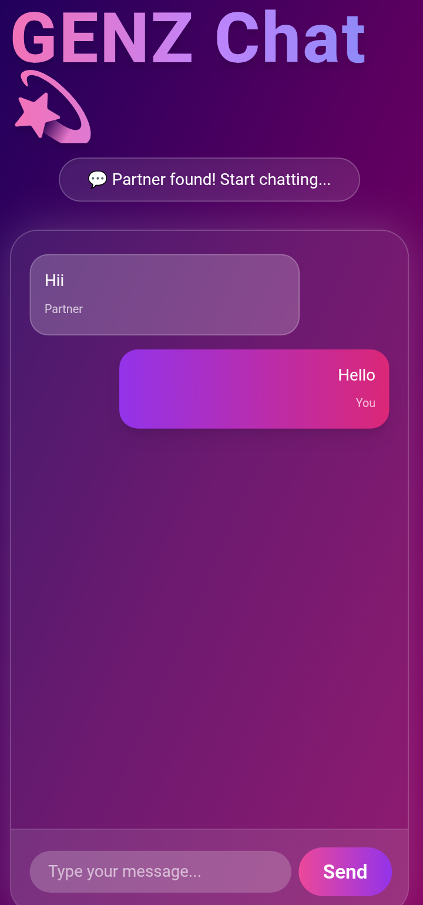

# 🌐 GenZ Real-Time Chat App 💬
` Temporary Unable video audio chat but Text Chatting active ✅ `

A **next-generation, full-stack chat application** with real-time messaging, image upload, and **audio/video call support** — built using **React + Node.js + Socket.io + WebRTC** and styled with **Tailwind CSS**.  
Fully responsive, **mobile-friendly**, and deployable on **Render (backend)** & **Vercel (frontend)**.

---

## 🚀 Live Demo

🔹 **Frontend (Vercel):** [CHECK LIVE✅](https://genz-backend-eqxf.vercel.app/)  
🔹 **Backend (Render):** [Null]()

---

## 📱 UI Preview

| Chat Interface | Incoming Call | Video Call |
|----------------|----------------|-------------|
|  | 
---

## ⚡ Features

✅ Real-time text chat with Socket.io  
✅ Image upload with preview  
✅ WebRTC video & audio calls  
✅ Typing indicators & online status  
✅ Dynamic chat bubbles and reactions  
✅ Responsive mobile-first layout  
✅ Tailwind CSS for modern design  
✅ Secure backend (Express + CORS + dotenv)  
✅ Hosted on **Render + Vercel**

---

## 🛠️ Tech Stack

| Category | Technologies |
|-----------|--------------|
| **Frontend** | React, Vite, Tailwind CSS, Socket.io-client |
| **Backend** | Node.js, Express, Socket.io, WebRTC |
| **Database (optional)** | MongoDB / Firebase |
| **Hosting** | Vercel (Client) + Render (Server) |

---

## DEV by KAZI ASHRAFUZZAMAN
